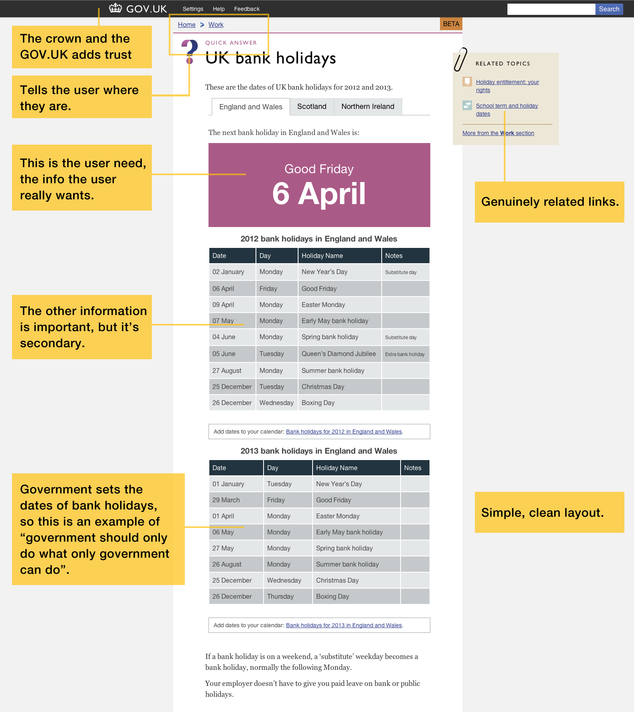

# Government Digital Service **Design Principles**

Listed below are our design principles and examples of how we’ve used them so far. These build on, and add to, our original [7 digital principles](http://www.flickr.com/photos/benterrett/7041509709/).

1. [Start with needs\*](#_start_with_needs)
2. [Do less](#do_less)
3. [Design with data](#_design_with_data)
4. [Do the hard work to make it simple](#_do_the_hard_work_to_make_it_simple)
5. [Iterate. Then iterate again.](#_iterate_then_iterate_again)
6. [Build for inclusion](#_build_for_inclusion)
7. [Understand context](#_understand_context)
8. [Build digital services, not websites](#_build_digital_services_not_websites)
9. [Be consistent, not uniform](#_be_consistent_not_uniform)
10. [Make things open: it makes things better](#_make_things_open_it_makes_things_better)

# Start with needs\*
### \*user needs not government needs

The design process must start with identifying and thinking about real
user needs. We should design around those — not around the way the
‘official process’ is at the moment. We must understand those needs thoroughly
— interrogating data, not just making assumptions — and we should
remember that what users ask for is not always what they need.

## Why

We use ‘needs’ as an organising principle since people come to our
sites to accomplish tasks and to fulfil needs, not just to hang out.
Focusing on needs means we can concentrate on the things that deliver
most value for money.

## Examples of how we start with needs.

If we start from the wrong place there’s no chance we will get
the design right. Before we begin any project we spend a long time
working out what the user needs are. [This blog post explains 
a bit more about how we do that.](http://digital.cabinetoffice.gov.uk/2011/09/19/introducing-the-needotron-working-out-the-shape-of-the-product/)

## Be clear

[This VAT page](https://www.gov.uk/vat-rates) is a good example of a design
that results from thinking about user needs. Most people will arrive at this
page after a search for VAT rates. The answer most people are after is 20%,
so we’ve made that the largest, clearest piece of information on the page.
You can get the answer you are looking for incredibly quickly. There is more
to VAT than just one rate so we’ve included this but clearly designed
as secondary information. There’s a slim chance you’ve arrived at the wrong
page so we have links to genuinely related items in the box on the top right.

The page is simple and clear but contains all the different information
you might need.

# Do less

Government should only do what only government can do. If someone else
is doing it — link to it. If we can provide resources
(like [APIs](http://en.wikipedia.org/wiki/Application_programming_interface))
that will help other people build things — do that. We should
concentrate on the irreducible core.

## Why

We’ll make better services and save more money by focusing resources
where they’ll do the most good.

## An example of how we are doing less

Lots of page designs fail because the focus of the page isn’t clear. Don’t try to cram everything on to one page. By trying to do less and deciding what’s the most important thing on the page before you start designing you’ll end up with simpler, clearer designs.

Remember that government should only do what only government can do,
so while it’s right we should provide information about VAT it’s not
necessary for us to provide information about [keeping bees](http://webarchive.nationalarchives.gov.uk/20121015000000/www.direct.gov.uk/en/Environmentandgreenerliving/Smallholders/DG_179478)

# Design with data

Normally, we’re not starting from scratch — users are already using
our services. This means we can learn from real world behaviour. We
should do this, but we should make sure we continue this into the
build and development process — prototyping and testing with real
users on the live web. We should understand the desire paths of how we are designing with data and use
them in our designs.

This is the great advantage of digital services — we can watch and
learn from user behaviour, shaping the system to fit what people
naturally choose to do rather than bending them to a system we’ve
invented.
         
## Examples of how we are designing with data

Desire paths are a great way to understand what your user is trying to do.

You can read a great explanation of
(desire paths on wikipedia)[http://en.wikipedia.org/wiki/Desire_path]
 as well as see some 
[examples in this flickr pool.](http://www.flickr.com/groups/desire_paths/pool/)

## A/B testing

We’re using (A/B testing)[http://en.wikipedia.org/wiki/A/B_testing]
to see how colour changes can affect user behaviour.

We’ll write more about what we are measuring around user behaviour soon.
There are lots of ways to approach this: to give one example
[Google Analytics](http://www.google.com/analytics/)
is a popular tool that can help assess user data.

# Do the hard work to make it simple

Making something look simple is easy; making something simple to use
is much harder — especially when the underlying systems are complex —
but that’s what we should be doing.
         
With great power comes great responsibility — very often people have
no choice but to use our services. If we don’t work hard to make them
simple and usable we’re abusing that power, and wasting people’s time.
         
## An example of where we have done the hard work to make something simple

You shouldn’t have to understand how government works to be able to interact
with it. Government and the services it provides are often complicated,
so we should hide complexity where possible.

Our [Smart Answer](http://digital.cabinetoffice.gov.uk/2012/02/16/smart-answers-are-smart/)
format is a good example of this. Both [Married Couple’s Allowance](https://www.gov.uk/calculate-married-couples-allowance)
and [Maternity Pay Entitlement](https://www.gov.uk/maternity-benefits)
are good examples of how we have taken something complicated and
made the interaction simple for the user.
[The code for smart answers is available on GitHub.](https://github.com/alphagov/smart-answers)

# Iterate. Then iterate again.
       
The best way to build effective services is to start small and iterate
wildly. Release 
[Minimum Viable Products](http://en.wikipedia.org/wiki/Minimum_viable_product)
early, test them with real users, move
from (Alpha)[http://en.wikipedia.org/wiki/Software_release_life_cycle#Alpha]
to [Beta]http://en.wikipedia.org/wiki/Software_release_life_cycle#Beta]
to Launch adding features and refinements based on feedback from real users.

Iteration reduces risk. It makes big failures unlikely and turns small
failures into lessons. This avoids the 200 page spec document
which can turn into a bottleneck. This, again, is the core advantage of
digital: we’re not building bridges — things can be undone.
             
## Some examples of how we have been iterating

Once you’re happy with what some code is doing, make sure it is ‘clean’ and easy to read to aid future maintenance by yourself and others. You might also consider using this to reduce complexity and code ‘bloat’. If you’ve built something twice before, pause before doing it a third time and consider whether you can refactor to avoid duplication. For instance, in your CSS, use classes rather than IDs to target commonly styled elements.

## Release and keep improving

Release often and release early.  A ‘launch’ is not the end of the project,
but an opportunity to test the product in the wild, and get feedback quickly.
Act on the feedback and continuously improve the product.
You can read some examples of this on the blog, [day 1 iterations](http://digital.cabinetoffice.gov.uk/2012/02/01/govuk-beta-day1/) and further iterations
the [following week](http://digital.cabinetoffice.gov.uk/2012/02/02/day-2-of-gov-uk-more-iteration/)
made on the GOV.UK beta, and the
[INSIDE GOVERNMENT first week iteration.](http://digital.cabinetoffice.gov.uk/2012/03/13/inside-government-how-busy-the-busy-bees-have-been/)

## Alpha. Beta.

We released an [alpha version of GOV.UK](http://alpha.gov.uk/)
last year and we released the [beta version](https://www.gov.uk/)
in January. Other people in government are starting to use this approach:
[Shropshire WIP](http://shropshire.gov.uk/projectwip/) and [DirectScot](http://www.directscot.org/) being good examples.

# Build for inclusion
       
Accessible design is good design. We should build a product that’s as
inclusive, legible and readable as possible. If we have to sacrifice
elegance — so be it. We shouldn’t be afraid of the obvious, shouldn’t
try to reinvent web design conventions and should set expectations
clearly.
         
We’re designing for the whole country — not just the ones who are used
to using the web. In fact, the people who most need our services are
often the people who find them hardest to use. If we think about those
people at the beginning we should make a better site for everyone.
         
## Some examples of how we have been building for inclusion

This table shows an example of using highly contrasting colours, which makes
the information easier to read.

## ARIA landmark roles

<pre><code>
&lt;div role="banner"&gt;
…
&lt;/div&gt;

&lt;div role="navigation"&gt;
&lt;ul&gt;
…
&lt;/ul&gt;
&lt;/div&gt;

&lt;div role="contentinfo"&gt;
…
&lt;/div&gt;
</code></pre>

ARIA landmark roles help people who use screen readers and other assistive
technologies understand the purpose of different areas of a page. This video
demonstrates how someone using a screen reader benefits from ARIA landmark
roles: 
[How ARIA landmark roles help screen reader users](http://www.nomensa.com/blog/2011/how-aria-landmark-roles-help-screen-reader-users/)

## Form fields and labels

<pre><code>

&lt;label for="name"&gt;Name:
&lt;input type="text" id="name" placeholder="For example John Smith" /&gt;
&lt;/label&gt;

&lt;label for="yes"&gt;
&lt;input type="radio" name="citizen" id="yes" value="yes" /&gt;
Yes&lt;/label&gt;
&lt;label for="no"&gt;

&lt;input type="radio" name="citizen" id="no" value="no"&gt;
No&lt;/label&gt;

</code></pre>
                

Form labels help everyone enter the right information. Associating the
form label and form field within the HTML means that people using screen
readers also have access to the label.

The position of the label text is important. For checkboxes and radio buttons
the label is best positioned to the right of the field. For all other field
types the label is best positioned to the left.

## Skip links and hidden content

<pre><code>&lt;!-- In HTML --&gt;
&lt;a href="#content" class="visuallyHidden"&gt;Skip to content &lt;/a&gt;

/* In CSS */
.visuallyHidden {
  position: absolute;
  left: -999em;
}</code></pre>

Skip links lead to a point on the same page instead of another page.
They provide a useful shortcut for people who do not use a mouse.

The best place to include a skip to content link is towards the top of the page.
This makes it easy for keyboard only users to reach,
and it provides a convenient way of moving keyboard focus directly
to the start of the main body of the page.

Skip links may be hidden from view by default, but should be brought into view
when the link is given keyboard focus.
This approach makes the skip link available to both sighted and
non sighted keyboard only users, whilst keeping the visual experience clean.

## Clear link text

<pre><code>&lt;a href="guide.html"&gt;Guide to maternity leave&lt;/a&gt;</code></pre>

Links should act like signposts to information. It’s best if they
do this concisely and accurately, so that people are given
a clear indication of where the link will lead.

It’s also a good idea to avoid references to the way the link will be activated.
People on touch screen devices won’t "Click here" for example,
and neither will people unable to use a mouse for accessibility reasons.

# Understand context
       
We’re not designing for a screen, we’re designing for people. We need
to think hard about the context in which they’re using our services.
Are they in a library? Are they on a phone? Are they only really
familiar with Facebook? Have they never used the web before?
         
We’re designing for a very diverse group of users with very different
technologies and needs. We need to make sure we’ve understood the
technological and practical circumstances in which our services are
used. Otherwise we risk designing beautiful services that aren’t
relevant to people’s lives.
         
## Examples of how we have been considering context
                  

Your service could be accessed from almost anywhere on a wide variety of devices
in all sorts of different environments. Consider how the usage might change for
each of these. For instance, a low-cost, low-power shared PC in a public library
or a smart phone used whilst walking down the street.

Remember we are designing information, not pushing pixels around a screen.

# Build digital services, not websites
       
Our service doesn’t begin and end at our website. It might start with
a search engine and end at the post office. We need to design for
that, even if we can’t control it. And we need to recognise that some
day, before we know it, it’ll be about different digital services
again.

We shouldn’t be about websites, we should be about digital services.
Right now, the best way to deliver digital services is via the web —
but that might change, and sooner than we might expect.

## One example of our content being used outside of our website

One example of this is the
[WordPress plugin that Saul Cozens](http://saulcozens.co.uk/pages/wordpressgovuk)
made to "reproduce content from GOV.UK on any Wordpress post or page."

# Be consistent, not uniform
       
Wherever possible we should use the same language and the same design
patterns — this helps people get familiar with our services. But, when
this isn’t possible, we should make sure our underlying approach is
consistent. So our users will have a reasonable chance of guessing
what they’re supposed to do.
         
This isn’t a straitjacket or a rule book. We can’t build great
services by rote. We can’t imagine every scenario and write rules for
it. Every circumstance is different and should be addressed on its own
terms. What unites things, therefore, should be a consistent approach
— one that users will hopefully come to understand and trust — even as
we move into new digital spaces.

## Examples of our design work being consistent but not uniform

So far we have released beta versions of GOV.UK and INSIDE GOVERNMENT.
Comparing page designs from both of these projects gives you
a good visual example of what we mean in this principle.
These designs feel like they come from the same family,
but they are different depending on the different requirements
of the page.
       
# Make things open: it makes things better

We should share what we’re doing whenever we can. With colleagues,
with users, with the world. Share code, share designs, share ideas,
share intentions, share failures. The more eyes there are on a service
the better it gets — howlers get spotted, better alternatives get
pointed out, the bar gets raised.

Partly because much of what we’re doing is only possible because of
open source code and the generosity of the web design community. So we
should pay that back. But mostly because more openness makes for
better services — better understood and better scrutinised. If we give
away our code, we’ll be repaid in better code. That’s why we’re giving
away all this...

## Design

This is an example from the [GOV.UK beta](https://www.gov.uk/)
that illustrates many of these design principles in action.

## Colour palette

These are the colours we’ve used for [GOV.UK](https://www.gov.uk/).
It’s a deliberately broad palette as the scope for the site is so large.
We use the paler colours the most and the stronger colours
when we want to draw attention to something.

You can [download this colour palette as an Adobe Swatch Exchange file](downloads/betacolours.ase), then you can import them straight
into Photoshop or Illustrator.

You can also [download a pdf of the colour palette](downloads/betacolours.pdf),
so you can copy and paste the hex values.

## Typography

Typography is extremely important in any design. It’s a key factor
in legibility. We have more control over web typography than ever before
and we should ensure our designs are clear and easy to read.

Over the next few months we will be testing different typographic designs.

Currently we’re using [Gill Sans](http://en.wikipedia.org/wiki/Gill_Sans)
for headlines and section headings. We’re using it as ‘web font’,
which isn’t without issues so we’re using it sparingly and carefully.
It adds character and, spaced properly, feels British and modern.

We’re using Georgia for body text. That’s text that you would actually read, as opposed to glance at, or as used in highlights or warnings.

It was also [created by a British typographer](http://en.wikipedia.org/wiki/Georgia_(typeface)).

For pretty much everything else we’re using Helvetica, where people have it
installed, or Arial.

The full list of type styles we’ve used is illustrated here.

## Icons

Here are the icons we’ve used on [GOV.UK](https://www.gov.uk/).

## Collaborative code

Tools like [Github](http://www.github.com) are useful because people
can make ‘[pull requests](http://help.github.com/send-pull-requests/)’
to help you improve your code. Find out more in our blog post —
[GOV.UK - a truly open and collaborative platform](http://digital.cabinetoffice.gov.uk/2012/02/02/gov-uk-truly-open-platform/).

## Content principles

Content is king. Our content design decisions, [style and tone are explained here](/design-principles/style-guide).

## Transactions

What is a transaction?

At the end of a transaction some kind of action has been performed (above and beyond the simple exchange of information). Typically this would involve an exchange of goods and money, but government transactions also involve the transfer or creation of legal rights and obligations. Another distinguishing feature of many government transactions is that they often involve more than two parties.

## More detail coming soon

We’re currently working on a broad range of transactions to create a pick’n’mix of consistent design patterns which we can choose from for use in a number of scenarios.

## Some things we’ve banned

We should be simple and clear in all our communications. Visual
metaphors which are overused tend to hinder communication rather than
help it. For that reason lightbulbs, brains, jigsaws, cheetahs,
chameleons and butterflies are all banned.

# Feedback

This is an alpha release of the principles and we would like your feedback.
Is there anything you think we should add that would make these principles
more helpful? You can email your feedback to
[govuk-feedback@digital.cabinet-office.gov.uk](mailto:govuk-feedback@digital.cabinet-office.gov.uk).

