# **Принципы проектирования** британских цифровых услуг правительства

Ниже перечислены наши принципы проектирования и примеры того,
как мы использовали их на практике. Эти принципы построены на наших
оригинальных [7 принципах](http://www.flickr.com/photos/benterrett/7041509709/)
и дополняют их список.

1. [Начинайте с потребностей\*](#_start_with_needs)
2. [Делайте меньше](#do_less)
3. [Проектируйте, используя информацию](#_design_with_data)
4. [Усердно трудитесь, чтобы сделать все проще](#_do_the_hard_work_to_make_it_simple)
5. [Сделайте шаг. Повторите.](#_iterate_then_iterate_again)
6. [Создавайте ради приобщения](#_build_for_inclusion)
7. [Понимайте обстоятельства](#_understand_context)
8. [Создавайте цифровые услуги, а не сайты](#_build_digital_services_not_websites)
9. [Будьте последовательными, а не однообразными](#_be_consistent_not_uniform)
10. [Делайте все открыто: так все будет получаться лучше](#_make_things_open_it_makes_things_better)

# Начинайте с потребностей\*
### \*потребностей пользователей, а не правительства

Процесс проектирования должен начинаться с определения и обдумывания
потребностей реального пользователя. Мы должны ориентироваться на это, а не
на действующий на данный момент «официальный процесс». Мы должны понимать
эти потребности – собирая данные, а не только делая догадки – и мы должны
помнить, что то, чего просят пользователи, не всегда является тем, что им
действительно нужно.

Мы используем потребности как организационные принципы, так как пользователи заходят на наши сайты, чтобы выполнить задачи и удовлетворить потребности, а не просто, чтобы убить время. Акцентирование внимания на потребности означает, что мы можем сконцентрироваться на вещах, которые приносят большую ценность за деньги.

## Примеры того, как мы начинали с потребностей

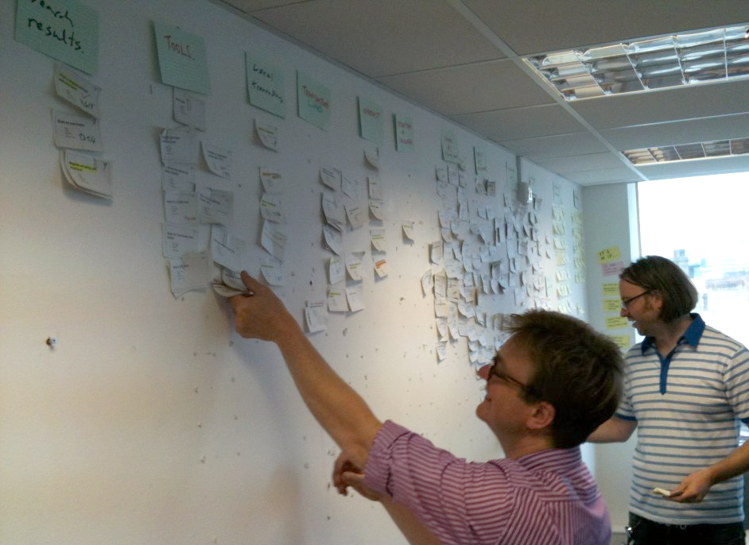

Если мы начнем не с того места, у нас не будет возможности получить правильный
дизайн. Перед началом любого проекта, мы тратим много времени на определение
действительных потребностей пользователя. 
[Эта статья описывает в основном то, как мы это делаем](http://digital.cabinetoffice.gov.uk/2011/09/19/introducing-the-needotron-working-out-the-shape-of-the-product/).

## Все должно быть понятно

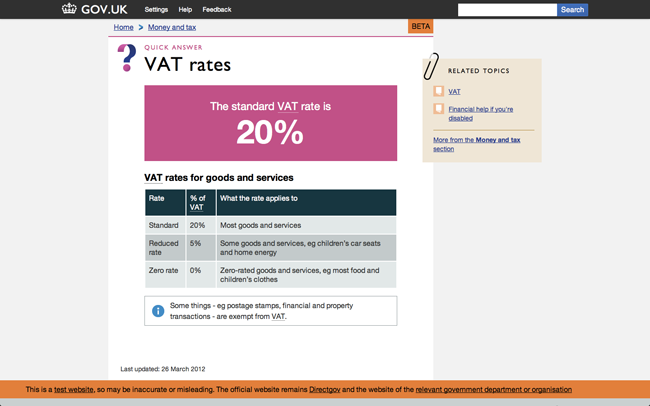

[Эта страница об НДС](https://www.gov.uk/vat-rates) является хорошим примером
дизайна на основе потребностей пользователей. Большинство людей попадут
на эту страницу в поисках ставки НДС. Ответ, который ищет большинство – 20%,
поэтому мы сделали его самой крупной и понятной частью информации на странице.
Получить ответ на искомый вопрос можно достаточно быстро. Кроме этого значения,
об НДС существует и другая информация, поэтому мы включили и ее, но в качестве
четко изложенной второстепенной информации. Также есть небольшая вероятность,
что вы попали на эту страницу по ошибке, поэтому в поле в верхнем правом углу
есть несколько ссылок на связанные с НДС темы.

Эта страница проста и понятна, но содержит различную информацию, которая может вам потребоваться.

# Делайте меньше

Правительство должно делать только то, что может делать только правительство.
Если кто-то другой это делает – сделайте на него ссылку. Если можно предложить
ресурсы (например, [API](https://ru.wikipedia.org/wiki/%D0%98%D0%BD%D1%82%D0%B5%D1%80%D1%84%D0%B5%D0%B9%D1%81_%D0%BF%D1%80%D0%BE%D0%B3%D1%80%D0%B0%D0%BC%D0%BC%D0%B8%D1%80%D0%BE%D0%B2%D0%B0%D0%BD%D0%B8%D1%8F_%D0%BF%D1%80%D0%B8%D0%BB%D0%BE%D0%B6%D0%B5%D0%BD%D0%B8%D0%B9)), которые помогут людям что-то сделать – предложите их.
Мы должны сконцентрироваться на минимально возможном ядре.

Мы можем создать оптимальные службы и сэкономить больше денег,
если будем фокусировать ресурсы там, где они принесут наибольшую пользу.

## Пример того, как мы делаем меньше

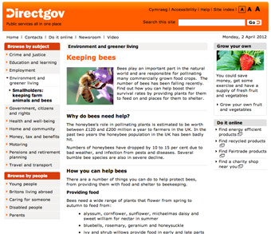

Большинство примеров дизайна страниц можно назвать неудачными, так как непонятно, чему посвящена страница. Не пытайтесь нагрузить страницу всем, чем только можно. Если вы будете стараться делать меньше и еще перед началом создания дизайна определите, что на вашей странице является наиболее важным, у вас получится более простой и понятный дизайн.

Запомните, что правительство должно делать только то, что может делать только правительство, поэтому, если нам нужно предоставить информацию об НДС, нам совсем не нужно предоставлять еще и информацию о [разведении пчел](http://webarchive.nationalarchives.gov.uk/20121015000000/www.direct.gov.uk/en/Environmentandgreenerliving/Smallholders/DG_179478).

# Проектируйте, используя информацию

Как правило, мы не начинаем с нуля – пользователи уже используют наши сервисы. Это значит, что у нас есть возможность учиться на реальном поведении мира. Это действительно стоит делать, но также следует убедиться, что мы продолжаем это делать и в процессе построения и развития – в создании прототипов и тестировании их на реальных пользователях в действующей сети. Мы должны понимать желаемые пути того, как мы будем проектировать при помощи данных, и использовать их в нашем дизайне.

В этом и состоит основное преимущество цифровых услуг – мы можем наблюдать и учиться на поведении пользователей, подгоняя систему под то, что людям действительно нужно сделать, вместо того, чтобы заставлять их приспосабливаться к созданной нами системе.

## Примеры того, как мы проектируем при помощи данных

Вытоптанные тропинки (desire paths) – это отличный способ понять, что пытается сделать ваш пользователь.

Отличное объяснение вытоптанных тропинок (desire paths) можно прочесть на [Википедии](https://en.wikipedia.org/wiki/Desire_path), а также посмотреть несколько примеров в [этом пуле на сайте Flickr](http://www.flickr.com/groups/desire_paths/pool/).

## A/B тестирование

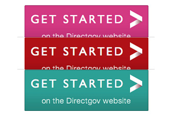

Мы используем [A/B тестирование](https://ru.wikipedia.org/wiki/A/B-%D1%82%D0%B5%D1%81%D1%82%D0%B8%D1%80%D0%BE%D0%B2%D0%B0%D0%BD%D0%B8%D0%B5), чтобы понять, как изменение цвета влияет на поведение
пользователя.

Вскоре мы более подробно опишем, что мы измеряем в отношении поведения пользователей. Существует множество способов провести такое тестирование – в качестве
примера можно привести [Google Analytics](http://www.google.com/analytics/),
который является популярным инструментом для оценки данных о пользователях.

# Усердно трудитесь, чтобы сделать все проще

Несложно сделать так, чтобы что-либо выглядело проще; а вот сделать что-то действительно простым намного сложнее, особенно когда в основе лежат довольно сложные системы, но именно это нам и следует делать.

С большой властью приходит большая ответственность – довольно часто у людей нет выбора, и им приходится использовать наши сервисы. Если мы не будем упорно работать, чтобы сделать их проще и удобнее, значит, мы злоупотребляем этой властью и напрасно тратим время людей.

## Пример того, где нам пришлось хорошо потрудиться, чтобы сделать что-либо простое

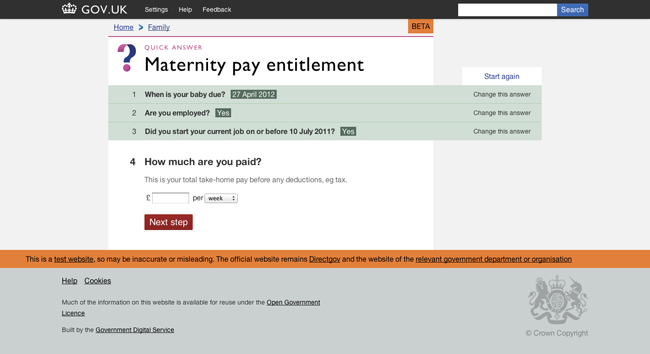

Вам необязательно понимать, как работает правительство, чтобы иметь возможность взаимодействовать с ним. Правительство и предоставляемые им услуги всегда довольно сложные, поэтому мы должны скрыть эту сложность где это только возможно.

Наш формат [Smart Answer](http://digital.cabinetoffice.gov.uk/2012/02/16/smart-answers-are-smart/)
представляет собой хороший пример. Как «[Скидка с подоходного налога для семейных пар](https://www.gov.uk/calculate-married-couples-allowance)»,
так и «[Пособие по беременности и родам](https://www.gov.uk/maternity-benefits)» –
это хорошие примеры того, как мы взяли нечто сложное и сделали из него простое
взаимодействие для пользователей. [Код для Smart Answer можно найти на GitHub](https://github.com/alphagov/smart-answers).

# Сделайте шаг. Повторите.

Лучший способ построить эффективный сервис – это начать с малого и пошагово развиваться в быстром темпе.
Сначала создайте [продукт с минимальным функционалом](http://en.wikipedia.org/wiki/Minimum_viable_product), протестируйте его на реальных пользователях,
продвигайтесь от [альфа-](http://en.wikipedia.org/wiki/Software_release_life_cycle#Alpha) и [бета-версий](http://en.wikipedia.org/wiki/Software_release_life_cycle#Beta) к запуску, добавляя функции и улучшения,
основанные на отзывах реальных пользователей.

Повторение снижает риск. Оно уменьшает вероятность крупных ошибок и превращает мелкие ошибки в уроки. Это позволяет избежать необходимости в 200-страничных документах, которые могут превратиться в «горлышко бутылки». В этом, опять же, состоит преимущество цифровой сферы: мы не строим мосты – все можно переделать.

## Несколько примеров того, как мы развивались

Как только вы обрадуетесь, что ваш код что-то делает, убедитесь, что он «чист» и легко читаем, чтобы упростить дальнейшую работу с ним как себе, так и кому-либо другому. Также это можно использовать, чтобы снизить уровень сложности и «раздутость» кода. Если вы дважды строили что-либо ранее, сделайте перерыв, прежде чем делать это в третий раз, и подумайте, как вы можете это перестроить, чтобы не повторяться. Например, при создании CSS используйте классы вместо ID для выбора стандартных элементов.

## Запускайте и продолжайте улучшать

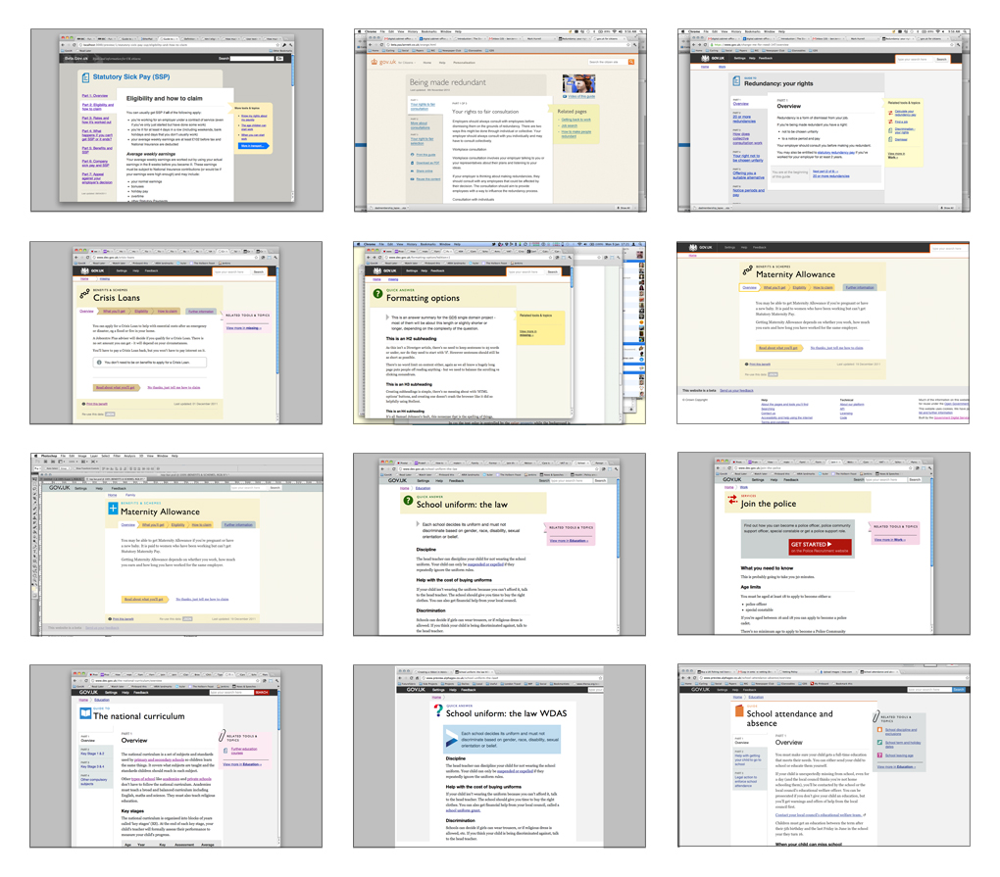

Выпускайте обновления как можно чаще и не медлите. «Запуск» – это не конец
проекта, а возможность протестировать продукт в естественных условиях
и сразу же получить отзывы. Действуйте в соответствии с отзывами и непрерывно
улучшайте свой продут. О нескольких примерах такого подхода вы можете прочесть
в блоге, [в цикле 1 дня](http://digital.cabinetoffice.gov.uk/2012/02/01/govuk-beta-day1/), и дальнейших циклах [следующей недели](http://digital.cabinetoffice.gov.uk/2012/02/02/day-2-of-gov-uk-more-iteration/) на GOV.UK beta,
а также о циклах обновлений, произведенных в первую неделю на сайте
[INSIDE GOVERNMENT](http://digital.cabinetoffice.gov.uk/2012/03/13/inside-government-how-busy-the-busy-bees-have-been/).

## Альфа. Бета.

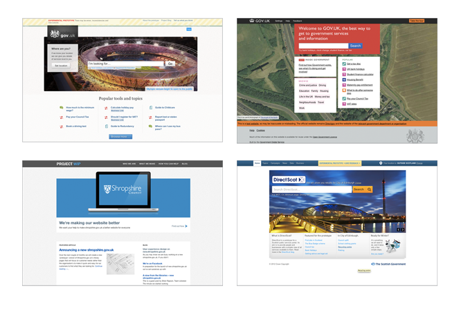

[Альфа-версию сайта GOV.UK](http://alpha.gov.uk/) мы выпустили в прошлом году,
а [бета-версия](https://www.gov.uk/) вышла в январе. Люди в правительстве
также начали использовать данный подход: [Shropshire WIP](http://shropshire.gov.uk/projectwip/) и [DirectScot](http://www.directscot.org/) - отличные тому примеры.

# Создавайте ради приобщения

Доступный дизайн – это хороший дизайн. Мы должны создавать продукт, который будет как можно более вовлекающим, доходчивым и читабельным. Если для этого придется пожертвовать элегантностью – так тому и быть. Не стоит бояться очевидного, не стоит пытаться заново придумывать идеи веб-дизайна, но следует четко определять ожидания.

Мы создаем дизайн для всей страны, а не только для тех, кто привык пользоваться сетью. Фактически, в наших сервисах в основном нуждаются те, кому их наиболее сложно использовать. Если мы будем с самого начала думать об этих людях, мы сможем создать лучший сайт для всех.

## Несколько примеров того, как мы строили ради приобщения

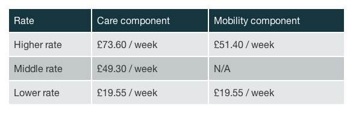

Эта таблица представляет собой пример использования высококонтрастных цветов, делающих информацию удобнее для чтения.

## Роли разметки ARIA

<pre><code>
&lt;div role="banner"&gt;
…
&lt;/div&gt;

&lt;div role="navigation"&gt;
&lt;ul&gt;
…
&lt;/ul&gt;
&lt;/div&gt;

&lt;div role="contentinfo"&gt;
…
&lt;/div&gt;
</code></pre>

Роли разметки ARIA помогают людям, использующим экранные дикторы и прочие вспомогательные технологии, понимать назначения различных областей страницы. В этом видео-ролике показано, как кто-то пользуется преимуществами экранного диктора за счет ролей разметки ARIA:

[How ARIA landmark roles help screen reader users](http://www.nomensa.com/blog/2011/how-aria-landmark-roles-help-screen-reader-users/)

## Поля и метки формы

<pre><code>

&lt;label for="name"&gt;Name:
&lt;input type="text" id="name" placeholder="For example John Smith" /&gt;
&lt;/label&gt;

&lt;label for="yes"&gt;
&lt;input type="radio" name="citizen" id="yes" value="yes" /&gt;
Yes&lt;/label&gt;
&lt;label for="no"&gt;

&lt;input type="radio" name="citizen" id="no" value="no"&gt;
No&lt;/label&gt;

</code></pre>
                

Метки формы помогают ввести правильную информацию. Связывание меток формы и полей формы через HTML означает, что люди, использующие экранные дикторы, тоже смогут использовать метки.

Положение текста меток имеет очень большое значение. Для флажков и переключателей метку лучше расположить справа от поля. Для любых других типов полей метку лучше размещать слева.

## Ссылки для пропуска и скрытый контент

<pre><code>&lt;!-- In HTML --&gt;
&lt;a href="#content" class="visuallyHidden"&gt;Skip to content &lt;/a&gt;

/* In CSS */
.visuallyHidden {
  position: absolute;
  left: -999em;
}</code></pre>

Ссылки для пропуска переносят вас в точку на той же странице вместо другой страницы. Они позволяют сократить путь людям, не использующим мышь.

Оптимальное место для размещения ссылки для пропуска контента – это где-нибудь вверху страницы. Там до нее будет проще добраться пользователям, использующим только клавиатуру, и так она будет обеспечивать удобный способ перемещения фокуса клавиатуры непосредственно на начало основного тела страницы.

Ссылки для пропуска могут быть по умолчанию скрыты из виду, и отображаться когда на ссылку наводится фокус клавиатуры. Такой подход делает ссылки для пропуска доступными как для зрячих, так и незрячих пользователей, использующих только клавиатуру, в то же время создавая чистый зрительный опыт.

## Понятный текст ссылок

<pre><code>&lt;a href="guide.html"&gt;Guide to maternity leave&lt;/a&gt;</code></pre>

Ссылки должны выступать в качестве указателя на информацию. Лучше всего, если они будут делать это емко и точно, так, чтобы люди четко понимали, куда приведет их эта ссылка.

Также отличной идеей является отказ от указаний способа, которым можно активировать ссылку. Люди, использующие устройства с сенсорными экранами, не могут «Кликнуть сюда», например, и то же самое касается людей, не использующих мышь ввиду ограниченных возможностей.

# Понимайте обстоятельства

Мы создаем дизайн не для экрана, мы создаем его для людей. Поэтому необходимо тщательно обдумать ситуацию, в которой они используют наши услуги. Они сидят в библиотеке? Они сидят с телефона? Они знают только что такое Facebook? Они когда-либо ранее пользовались Интернетом?

Мы создаем дизайн для очень разнообразной группы пользователей с разными технологиями и потребностями. Нам необходимо убедиться, что мы понимаем технологические и практические обстоятельства, в которых используются наши сервисы. В противном случае мы рискуем создать прекрасный сервис, никак не связанный с жизнью людей.

## Примеры того, как мы учитываем обстоятельства

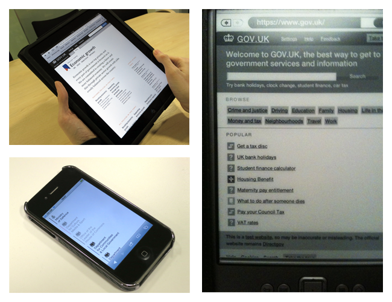

Доступ к вашему сервису можно получить практически из любой точки мира с самых разных устройств и в разных обстоятельствах. Учитывайте, как может измениться способ использования для каждой ситуации. Например, это может быть дешевый маломощный компьютер в общественной библиотеке или смартфон, используемый на ходу.

Помните, что мы создаем информацию, а не только гоняем пиксели по экрану.

# Создавайте цифровые услуги, а не сайты

Наша услуга не начинается и не заканчивается на нашем сайте. Она должна начинаться с поискового движка и заканчиваться в отделении почты. Мы должны создавать дизайн именно для этого, даже если мы не можем это контролировать. И мы должны осознавать, что однажды, неожиданно для нас, появится новая цифровая услуга.

Мы должны ориентироваться не на сайты, а на цифровые услуги. На данный момент наилучшим способом предоставления цифровых услуг является Интернет, но все может измениться, причем раньше, чем мы можем этого ожидать.

## Один пример использования нашего контента за пределами нашего сайта

Один из таких примеров – это [плагин WordPress](http://saulcozens.co.uk/pages/wordpressgovuk),
созданный Саулом Козенсом для «воспроизведения контента с сайта GOV.UK через любое сообщение или страницу WordPress».

# Будьте последовательными, а не однообразными

Желательно использовать один и тот же язык и те же шаблоны дизайна везде, где это возможно – это помогает людям привыкнуть к нашим сервисам. Однако, если это невозможно, необходимо убедиться, что лежащий в основе подход является последовательным. Так нашим пользователям будет предоставлена хорошая возможность догадаться, что они должны сделать.

Это не обязательное ограничение и не свод правил. Мы не можем строить отличные сервисы на память. Мы даже не можем представить сценарий и написать к нему правила. Каждое обстоятельство отличается от других и должно рассматриваться на своих собственных условиях. Поэтому, вещи должен объединять последовательный подход – такой, к которому пользователи будут с надеждой обращаться и понимать, даже если нам придется перейти в новые информационные пространства.

## Пример нашей дизайнерской работы, которая является последовательной, но не однообразной

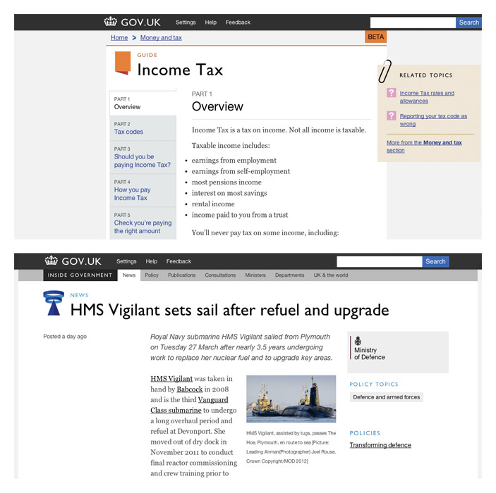

Пока что мы запустили бета-версии наших сайтов GOV.UK и INSIDE GOVERNMENT.
Сравнение дизайна страниц в обоих этих проектах покажет вам хороший визуальный
пример того, что мы понимаем под этим принципом. Кажется, будто эти варианты
дизайна являются членами одной семьи, при этом они отличаются в зависимости
от различных требований страницы.

# Делайте все открыто: так все будет получаться лучше

Мы должны как можно чаще делиться всем, что мы делаем. С коллегами, с пользователями, с миром. Делиться кодом, делиться дизайном, делиться идеями, делиться намерениями, делиться ошибками. Чем больше глаз смотрит на один сервис, тем лучше он становится – ошибки исправляются, вырабатываются лучшие варианты, повышается качество.

Частично потому, что большая часть того, что мы делаем, возможна только
благодаря открытым исходникам и отзывчивости сообщества веб-дизайнеров.
Поэтому, за это нужно платить тем же. Но в основном это потому, что открытость
делает сервисы лучше – более понятными и более поучительными. Если мы сделаем
наш код открытым, в ответ мы получим еще лучший код. Именно поэтому мы всем
этим делимся.

## Дизайн

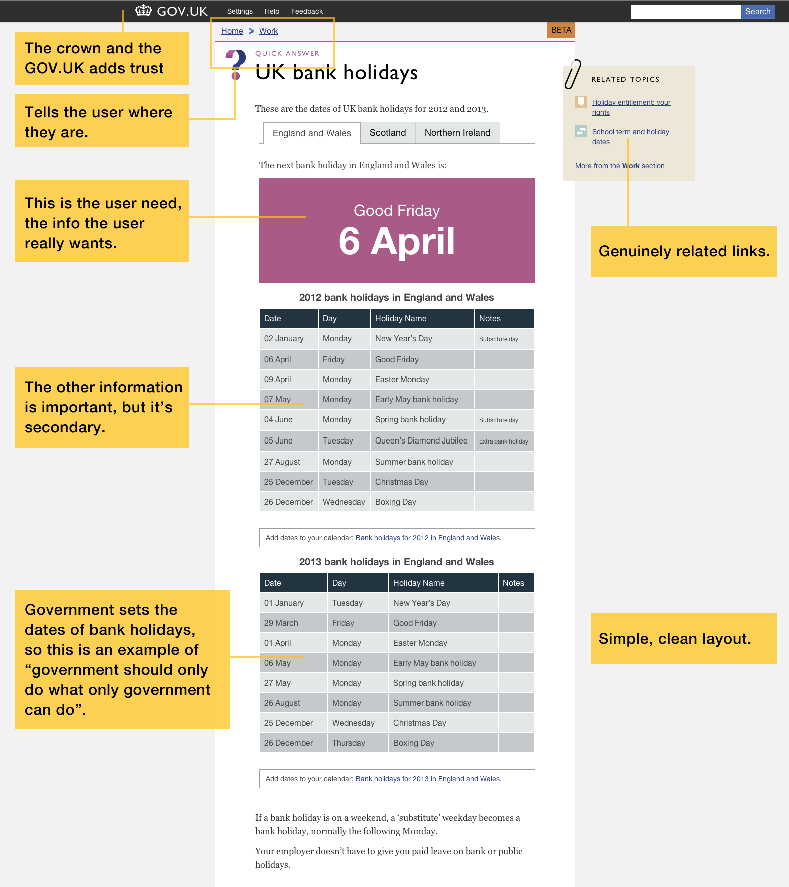

Это пример с [GOV.UK beta](https://www.gov.uk/), который демонстрирует большинство этих принципов дизайна в действии.

## Палитра цветов

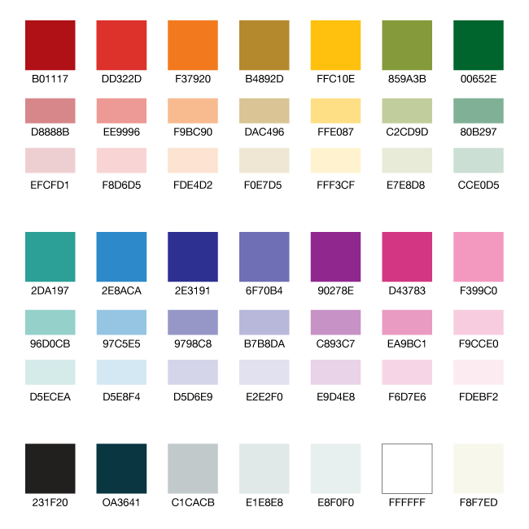

Это цвета, которые мы использовали для [GOV.UK](https://www.gov.uk/). Палитра довольно обширна, так как у сайта довольно большие потребности. В качестве основы мы использовали более светлые цвета, а более яркие использовали для привлечения внимания к чему-либо.

Вы можете [скачать эту палитру цветов в виде файла Adobe Swatch Exchange](downloads/betacolours.ase), а потом импортировать их прямо в Photoshop или Illustrator.

Также можно скачать [pdf-файл палитры цветов](downloads/betacolours.ase),
чтобы копировать и вставлять их шестизначные коды.

## Шрифты

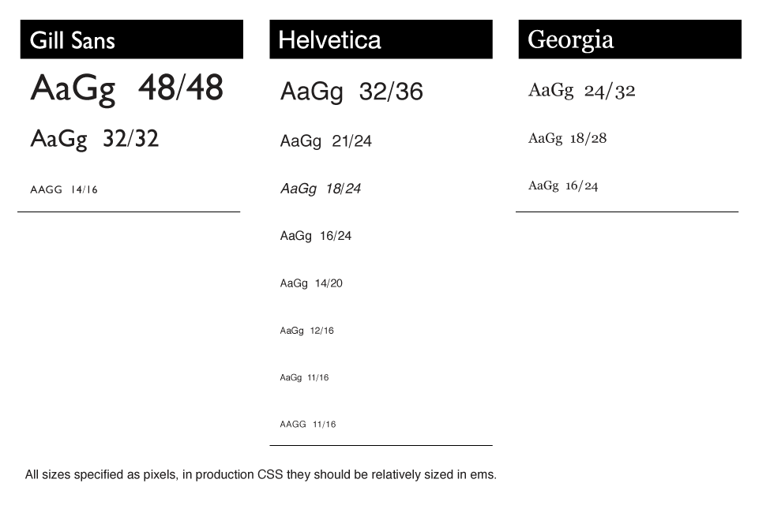

Шрифты – это достаточно важная часть дизайна. Это ключевой фактор его удобочитаемости. Сегодня мы обладаем большим контролем над шрифтами в сети, чем когда-либо ранее, а потому мы должны убедиться, что наш дизайн понятный и удобочитаемый.

На протяжении следующих нескольких месяцев мы будем тестировать различные виды дизайна шрифтов.

На данный момент для заголовков и названий разделов мы используем [Gill Sans](http://en.wikipedia.org/wiki/Gill_Sans).
Мы используем технологию «веб-шрифт», которую нельзя назвать идеальной,
а потому использовать это шрифт нужно умеренно и осторожно. Он придает характер
и, если сделать правильные интервалы, выглядит по-британски и современно.

Для тела текста мы используем шрифт Georgia. Это именно тот текст, который вы будете читать, в отличие от того, на который бросите беглый взгляд, или который будет использоваться для привлечения внимания или предупреждений.

Он был также создан [британским оформителем шрифтов](http://en.wikipedia.org/wiki/Georgia_().

Для всего остального мы используем шрифт Helvetica, если у людей он установлен, или Arial.

Полный список стилей шрифтов, используемых нами, демонстрируется здесь же.

## Иконки

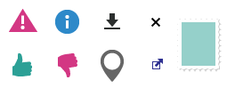

Вот иконки, которые мы использовали на сайте GOV.UK.

## Коллективно созданный код

Инструменты типа [Github](http://www.github.com) довольно удобны,
потому что люди могут делать «[запрос на внесение изменений](http://help.github.com/send-pull-requests/)»
чтобы помочь вам улучшить ваш код. Больше об этом можно узнать в нашей статье –
«[GOV.UK – полностью открытая и коллективно созданная платформа](http://digital.cabinetoffice.gov.uk/2012/02/02/gov-uk-truly-open-platform/)»
(GOV.UK – a truly open and collaborative platform).

## Принципы контента

Контент – всему голова. Наши решения, [стиль и способы создания дизайна контента описаны здесь](/design-principles/style-guide).

## Операции

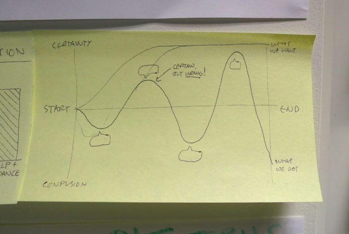

Что такое «операция»?

В конце операции должно произойти какое-либо действие (больше ожидаемого простого обмена информацией). Обычно она включает обмен товарами и денежными средствами, однако операции правительства также включают передачу или создание законных прав и обязанностей. Еще одна отличительная черта большинства правительственных операций заключается в том, что в ней часто принимают участие более двух сторон.

## Больше подробностей в ближайшем будущем

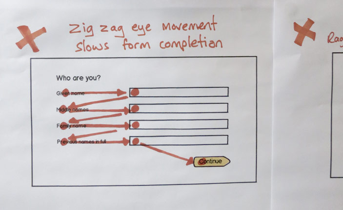

В данный момент мы работаем над рядом операций для создания набора последовательных шаблонов дизайна, которые мы сможем в дальнейшем выбирать и использовать в различных сценариях.

## Некоторые идеи, от которых мы отказались

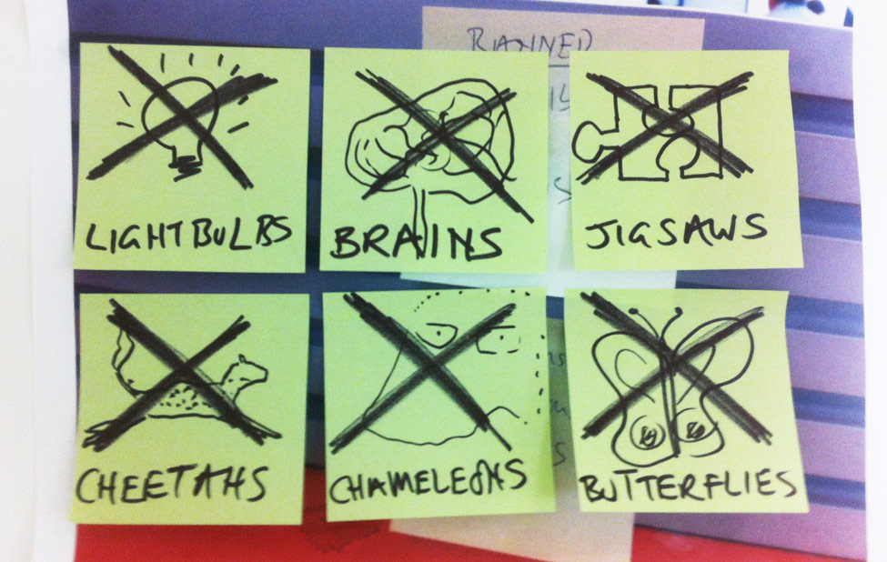

В наших попытках сообщить информацию мы должны быть простыми и понятными. Слишком часто используемые визуальные метафоры осложняют сообщение, вместо того, чтобы помочь. Поэтому от таких метафор, как лампочки, мозги, головоломки, гепарды, хамелеоны и бабочки, мы отказались.

# О переводе

Перевели в компании [UXDepot](http://www.uxdepot.ru/). Взято [отсюда](http://www.uxfox.ru/btitish-goverment-design-principles/).
