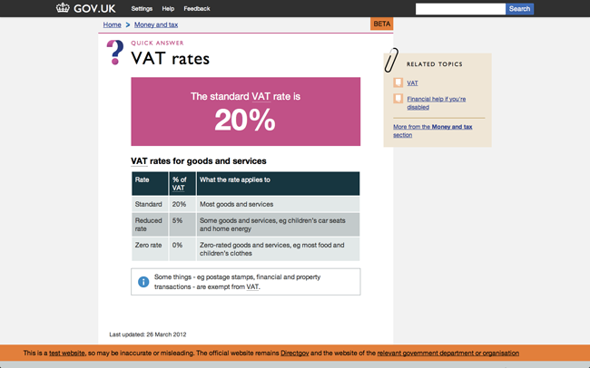
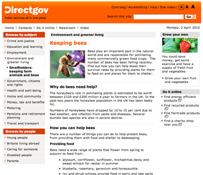
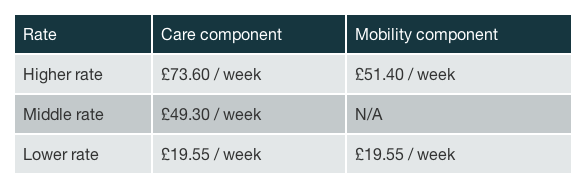
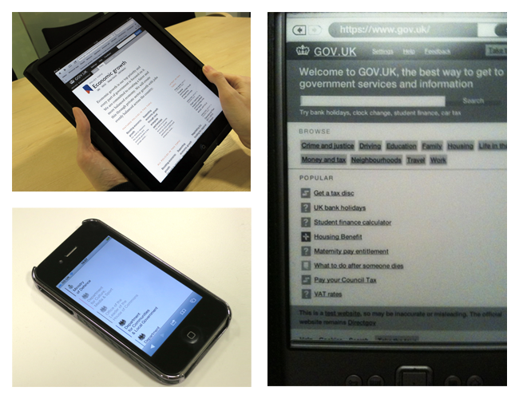
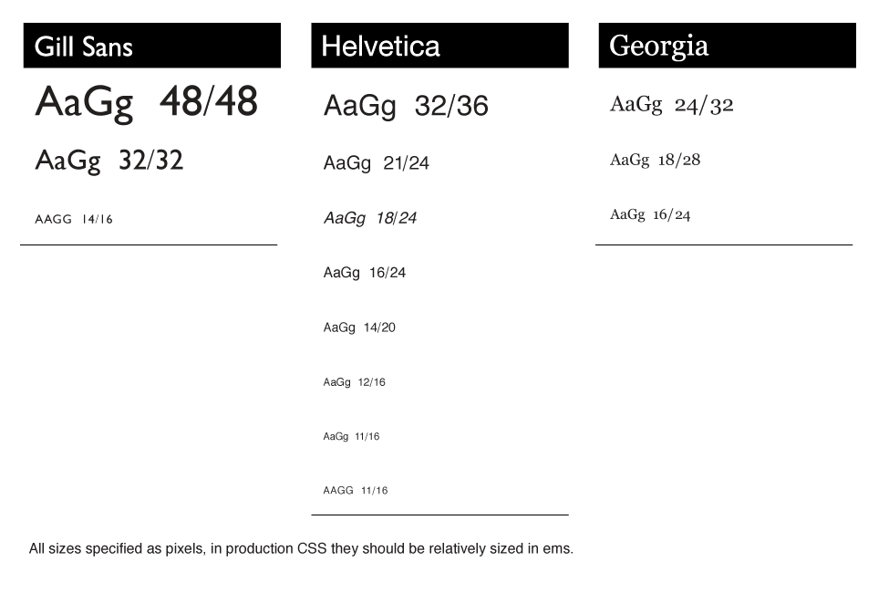

# **Принципи проектування** цифрових послуг британського уряду

Нижче наведені загальни принципи проектування та приклади їх практичного використання. Загальні принципи такі:

1. [Починайте з потреб\*](#_start_with_needs)
2. [Робіть менше](#do_less)
3. [Проектуйте свідомо](#_design_with_data)
4. [Робить все заради спрощення](#_do_the_hard_work_to_make_it_simple)
5. [Просувайтесь крок за кроком](#_iterate_then_iterate_again)
6. [Створюйте заради долучення](#_build_for_inclusion)
7. [Сприймайте обставини](#_understand_context)
8. [Створюйте цифрові послуги, а не сайти](#_build_digital_services_not_websites)
9. [Будьте послідовними, але не одноманітними](#_be_consistent_not_uniform)
10. [Робіть все відкрито: так виходит краще](#_make_things_open_it_makes_things_better)

# Починайте з потреб\*
### \*потреб користувачів, а не уряду.

Процесс проектування має починатися з виявлення та анізу потреб простого користувача. Ми маємо бути зорієнтовані саме на це та не зважати на дурниці, навідь якщо вони мають гриф "офіційно". Наше розуміння потреб має базуватися на фактах, а не на припущеннях чи побажаннях: слід усвідомлювати, що те, про що просить користувач не завжди є тим, чого він насправді хоче.

Саме потреби ми використовуєм як організаційні принципи, тому що користувачі заходять на наші сайти не для того, щоб згаяти час: їм потрібні відповіді. Такий підхід дозволяє сконцентруватися на головному, на тих речах, які неможливо оцінити грошима.

## Приклади того, як ми починали з потреб

Якщо ми почнемо не з головного, у нас не буде можливості створити приваблюючий та фукціональний дизайн. Тому перед початком буть-якого проекту ми приділяєм багото часу на виявлення справжніх потреб користувача.

[Ця стаття описує в основному те, як ми це робим](http://digital.cabinetoffice.gov.uk/2011/09/19/introducing-the-needotron-working-out-the-shape-of-the-product/).

## Все має бути зрозумілим

[Ця сторінка про ПДВ](https://www.gov.uk/vat-rates) є добрим прикладом дизайну, який відповідає потребам користувача. Більшість людей відвідають цю сторінку в пошуках ставки ПДВ. Відповідь, яка їм потрібна - 20%, тому цю цифру видно одразу. Крім цього, існує й інша інформація про ПДВ, яку ми також наводимо, але в якості додаткової інформації. Також існує ймовірність, що користувач потрапив на сторінку помилково, тому в верхньому куті праворуч наведено кілька посилань на пов'язані с ПДВ теми.

Ця сторінка проста та зрозуміла, вона містить різну інформацію, але вся вона може знадобитися.

# Робіть менше

Уряд має робити те, ща може зробити лише він. Якщо хтось може це зробити - наведить посилання на нього. Якщо ви можете запропонувати будь-який ресурс (наприклад, [API](https://ru.wikipedia.org/wiki/%D0%98%D0%BD%D1%82%D0%B5%D1%80%D1%84%D0%B5%D0%B9%D1%81_%D0%BF%D1%80%D0%BE%D0%B3%D1%80%D0%B0%D0%BC%D0%BC%D0%B8%D1%80%D0%BE%D0%B2%D0%B0%D0%BD%D0%B8%D1%8F_%D0%BF%D1%80%D0%B8%D0%BB%D0%BE%D0%B6%D0%B5%D0%BD%D0%B8%D0%B9)), який може допомогти людям - обов'яково зробить це. 

Ми  маємо сконцентруватися на головному. Наша мета - створення ефективних сервісів при мінімальних бюджетах. Тому треба робити те, що принесе найбільшу користь.

## Приклад того, як ми робим менше

Дизайни багатьох сайтів можна вважати невдалими через те, що не зрозуміло чому присвячена та чи інша сторінка. Не намагайтеся розмістити все, що тільки можна. Якщо ви спробуєте зробити менше та з самого початку визначите, що є головним - ви отримаете простий та зрозумілий дизайн.

Ще раз наголосимо, що уряд має робити лише те, що може зробити тільки він. Тому, якщо вам потрібно навести інформацію про ПДВ - зовсім непотрібно писати
[про бджіл](http://webarchive.nationalarchives.gov.uk/20121015000000/www.direct.gov.uk/en/Environmentandgreenerliving/Smallholders/DG_179478).

# Проектуйте свідомо

Частіше за все, ми починаємо не на пустому місці. Люди вже користуються подібними сервісами, а це означає, що ми можемо аналізувати як все праціє насправді. Це дійсно варто робити. Слід про це пам'ятати під час створення та розвитку проектів - на стадії розробки протипів та їх тестуванні звичайними користувачами в реальних умовах. Для нас важливо розуміти суть: що головне, а що другорядне, та вірно розставляти акценти при створенні дизайну.

В цьому полягає голова перевага цифрових послуг - ми можемо спостерігати за поведінкою користувачів та змінювати систему залежно від їх потреб. Ми маємо адаптувати систему під людей, а не навпаки: примущувати людей пристосовуватись до системи.

## Приклада того, як ми проектуємо свідомо

Натоптані стежки – це кращій спосіб зрозуміти, що хоче зробити користувач. 

Блискуче пояснення, що таке натоптані стежки в данному контексті, можете прочитать на [Вікіпедії](https://en.wikipedia.org/wiki/Desire_path), а також побачити кілька прикладів [в цьому пулі на сайті Flickr](http://www.flickr.com/groups/desire_paths/pool/).

## A/B тестування

Ми використовуєм [A/B тестирование](https://ru.wikipedia.org/wiki/A/B-%D1%82%D0%B5%D1%81%D1%82%D0%B8%D1%80%D0%BE%D0%B2%D0%B0%D0%BD%D0%B8%D0%B5), щоб зрозуміти, как колір впливає на поведінку користувача. 

Далі ми докладніше розкажемо на що звертати увагу при аналізі поведінки корустувача. Існує кілько способів провести таке тестування - в якості приклада не можемо не навести [Google Analytics](http://www.google.com/analytics/), який є досить популярним інструментом.

# Робіть все заради спрощення

Легко зроби так, щоб щось виглядало простим; а ось зробити щось дійсно простим - складно, особливо коли мова йже про складні речі. Але саме це треба робити.

З великою владою приходить і велика відповідальність - досить часто люди не мають вибору і використовують саме наші сервіси. Якщо ми не будимо приклати зусиль для того, щоб зробити їх простими та зручними, це означає, що ми зловживаємо владою на марно гаємо час користувачів.

## Приклад того, як ми зробили все заради спрощення

Вам не обов'язково розуміти як працює уряд, щоб взаємодіяти з ним. Уряд може надавати досить скоадні послуги, проте всю складність ми маємо приховати настільки, наскільки це можливо.

Наш формат [Smart Answer](http://digital.cabinetoffice.gov.uk/2012/02/16/smart-answers-are-smart/)
є добрим прикладом. Як «[Знижка з прибуткового податку для родинних пар](https://www.gov.uk/calculate-married-couples-allowance)»,
так і «[Допомога при вагітності та пологах](https://www.gov.uk/maternity-benefits)» – це хороші приклади того, як ми взяли щось складне та зробили з нього щось просте та зрозуміле. [Код для Smart Answer ви можете знайти на GitHub](https://github.com/alphagov/smart-answers).

# Просувайтесь крок за кроком

Кращій спосіб створити ефективний сервіс - це почати с чогось малого та потім поступово ускладнювати в швидкому темпі. Тому спочатку створюйте [продукт з мінімальним функціоналом](http://en.wikipedia.org/wiki/Minimum_viable_product), протестуйте його на реальних людях,
просувайтесь від [альфа-](http://en.wikipedia.org/wiki/Software_release_life_cycle#Alpha) та [бета-версій](http://en.wikipedia.org/wiki/Software_release_life_cycle#Beta) до кынцевого результату, додаючи нових функцій та вдосконалень, які основані на поведінці на відгуках користувачів.

Просування крок за кроком мінімізує ризики. Воно зводить нанівець вірогідність великих помилок та перетворює дрібні помилки на уроки. Це дозволяє уникнути необхідності детальних описів на 200 сторінок, які часто стають вузьким місцем. В цьому ж, знов таки, є перевага цифрових технологій: не мости будуємо - все можна виправити.

## Кілька прикладів як ми просувались крок за кроком

Як тільки ви зраділи, що ваш код працює, впевніться в тому, що что він "чистий" та зрозумілий, щоб спростити подальшу роботу з ним собі чи коллегам. Часто це також призводить до спрощення та скорочення коду. Якщо ви робили щось однакове двічі, зробіть перерву, перш ніж зробити втретє. Подумайте, як ви можете все перебудувати, щоб не повторюватися. Наприклад, використовуйте класи CSS замість ID для вибору стандартних елементів.

## Запускайте та вдосконалюйте

Робіть оновлення як можна частіше - не зволікайте. "Запуск" - це не кінець проекту, а можливість протестувати продукт в реальних умовах та отримати відгуки. Аналізуйте їх та безперервно вдосконялюйте свій продукт. Кілька прикладів ви можете знайти в блозі [в циклі 1 дня](http://digital.cabinetoffice.gov.uk/2012/02/01/govuk-beta-day1/), та подальших циклах  [наступного тиждня](http://digital.cabinetoffice.gov.uk/2012/02/02/day-2-of-gov-uk-more-iteration/) на GOV.UK beta,
а також прочитати про оновлення, які відбулися протягом першого тиждня на сайті
[INSIDE GOVERNMENT](http://digital.cabinetoffice.gov.uk/2012/03/13/inside-government-how-busy-the-busy-bees-have-been/).

## Альфа. Бета.

[Альфа-версію сайту GOV.UK](http://alpha.gov.uk/) ми випустили минулого року, а [бета-версія](https://www.gov.uk/) вийшла в січні. Урядовці також почали використовувати таких підхід: 
[Shropshire WIP](http://shropshire.gov.uk/projectwip/) та [DirectScot](http://www.directscot.org/) - гарні тому приклади.

# Створюйте заради долучення

Доступный дизайн – это хороший дизайн. Мы должны создавать продукт, который будет как можно более вовлекающим, доходчивым и читабельным. Если для этого придется пожертвовать элегантностью – так тому и быть. Не стоит бояться очевидного, не стоит пытаться заново придумывать идеи веб-дизайна, но следует четко определять ожидания.

Мы создаем дизайн для всей страны, а не только для тех, кто привык пользоваться сетью. Фактически, в наших сервисах в основном нуждаются те, кому их наиболее сложно использовать. Если мы будем с самого начала думать об этих людях, мы сможем создать лучший сайт для всех.

## Несколько примеров того, как мы строили ради приобщения

Эта таблица представляет собой пример использования высококонтрастных цветов, делающих информацию удобнее для чтения.

## Роли разметки ARIA

<pre><code>
&lt;div role="banner"&gt;
…
&lt;/div&gt;

&lt;div role="navigation"&gt;
&lt;ul&gt;
…
&lt;/ul&gt;
&lt;/div&gt;

&lt;div role="contentinfo"&gt;
…
&lt;/div&gt;
</code></pre>

Роли разметки ARIA помогают людям, использующим экранные дикторы и прочие вспомогательные технологии, понимать назначения различных областей страницы. В этом видео-ролике показано, как кто-то пользуется преимуществами экранного диктора за счет ролей разметки ARIA:

[How ARIA landmark roles help screen reader users](http://www.nomensa.com/blog/2011/how-aria-landmark-roles-help-screen-reader-users/)

## Поля и метки формы

<pre><code>

&lt;label for="name"&gt;Name:
&lt;input type="text" id="name" placeholder="For example John Smith" /&gt;
&lt;/label&gt;

&lt;label for="yes"&gt;
&lt;input type="radio" name="citizen" id="yes" value="yes" /&gt;
Yes&lt;/label&gt;
&lt;label for="no"&gt;

&lt;input type="radio" name="citizen" id="no" value="no"&gt;
No&lt;/label&gt;

</code></pre>
                

Метки формы помогают ввести правильную информацию. Связывание меток формы и полей формы через HTML означает, что люди, использующие экранные дикторы, тоже смогут использовать метки.

Положение текста меток имеет очень большое значение. Для флажков и переключателей метку лучше расположить справа от поля. Для любых других типов полей метку лучше размещать слева.

## Ссылки для пропуска и скрытый контент

<pre><code>&lt;!-- In HTML --&gt;
&lt;a href="#content" class="visuallyHidden"&gt;Skip to content &lt;/a&gt;

/* In CSS */
.visuallyHidden {
  position: absolute;
  left: -999em;
}</code></pre>

Ссылки для пропуска переносят вас в точку на той же странице вместо другой страницы. Они позволяют сократить путь людям, не использующим мышь.

Оптимальное место для размещения ссылки для пропуска контента – это где-нибудь вверху страницы. Там до нее будет проще добраться пользователям, использующим только клавиатуру, и так она будет обеспечивать удобный способ перемещения фокуса клавиатуры непосредственно на начало основного тела страницы.

Ссылки для пропуска могут быть по умолчанию скрыты из виду, и отображаться когда на ссылку наводится фокус клавиатуры. Такой подход делает ссылки для пропуска доступными как для зрячих, так и незрячих пользователей, использующих только клавиатуру, в то же время создавая чистый зрительный опыт.

## Понятный текст ссылок

<pre><code>&lt;a href="guide.html"&gt;Guide to maternity leave&lt;/a&gt;</code></pre>

Ссылки должны выступать в качестве указателя на информацию. Лучше всего, если они будут делать это емко и точно, так, чтобы люди четко понимали, куда приведет их эта ссылка.

Также отличной идеей является отказ от указаний способа, которым можно активировать ссылку. Люди, использующие устройства с сенсорными экранами, не могут «Кликнуть сюда», например, и то же самое касается людей, не использующих мышь ввиду ограниченных возможностей.

# Понимайте обстоятельства

Мы создаем дизайн не для экрана, мы создаем его для людей. Поэтому необходимо тщательно обдумать ситуацию, в которой они используют наши услуги. Они сидят в библиотеке? Они сидят с телефона? Они знают только что такое Facebook? Они когда-либо ранее пользовались Интернетом?

Мы создаем дизайн для очень разнообразной группы пользователей с разными технологиями и потребностями. Нам необходимо убедиться, что мы понимаем технологические и практические обстоятельства, в которых используются наши сервисы. В противном случае мы рискуем создать прекрасный сервис, никак не связанный с жизнью людей.

## Примеры того, как мы учитываем обстоятельства

Доступ к вашему сервису можно получить практически из любой точки мира с самых разных устройств и в разных обстоятельствах. Учитывайте, как может измениться способ использования для каждой ситуации. Например, это может быть дешевый маломощный компьютер в общественной библиотеке или смартфон, используемый на ходу.

Помните, что мы создаем информацию, а не только гоняем пиксели по экрану.

# Создавайте цифровые услуги, а не сайты

Наша услуга не начинается и не заканчивается на нашем сайте. Она должна начинаться с поискового движка и заканчиваться в отделении почты. Мы должны создавать дизайн именно для этого, даже если мы не можем это контролировать. И мы должны осознавать, что однажды, неожиданно для нас, появится новая цифровая услуга.

Мы должны ориентироваться не на сайты, а на цифровые услуги. На данный момент наилучшим способом предоставления цифровых услуг является Интернет, но все может измениться, причем раньше, чем мы можем этого ожидать.

## Один пример использования нашего контента за пределами нашего сайта

Один из таких примеров – это [плагин WordPress](http://saulcozens.co.uk/pages/wordpressgovuk),
созданный Саулом Козенсом для «воспроизведения контента с сайта GOV.UK через любое сообщение или страницу WordPress».

# Будьте последовательными, а не однообразными

Желательно использовать один и тот же язык и те же шаблоны дизайна везде, где это возможно – это помогает людям привыкнуть к нашим сервисам. Однако, если это невозможно, необходимо убедиться, что лежащий в основе подход является последовательным. Так нашим пользователям будет предоставлена хорошая возможность догадаться, что они должны сделать.

Это не обязательное ограничение и не свод правил. Мы не можем строить отличные сервисы на память. Мы даже не можем представить сценарий и написать к нему правила. Каждое обстоятельство отличается от других и должно рассматриваться на своих собственных условиях. Поэтому, вещи должен объединять последовательный подход – такой, к которому пользователи будут с надеждой обращаться и понимать, даже если нам придется перейти в новые информационные пространства.

## Пример нашей дизайнерской работы, которая является последовательной, но не однообразной

Пока что мы запустили бета-версии наших сайтов GOV.UK и INSIDE GOVERNMENT.
Сравнение дизайна страниц в обоих этих проектах покажет вам хороший визуальный
пример того, что мы понимаем под этим принципом. Кажется, будто эти варианты
дизайна являются членами одной семьи, при этом они отличаются в зависимости
от различных требований страницы.

#  Делайте все открыто: так все будет получаться лучше

Мы должны как можно чаще делиться всем, что мы делаем. С коллегами, с пользователями, с миром. Делиться кодом, делиться дизайном, делиться идеями, делиться намерениями, делиться ошибками. Чем больше глаз смотрит на один сервис, тем лучше он становится – ошибки исправляются, вырабатываются лучшие варианты, повышается качество.

Частично потому, что большая часть того, что мы делаем, возможна только
благодаря открытым исходникам и отзывчивости сообщества веб-дизайнеров.
Поэтому, за это нужно платить тем же. Но в основном это потому, что открытость
делает сервисы лучше – более понятными и более поучительными. Если мы сделаем
наш код открытым, в ответ мы получим еще лучший код. Именно поэтому мы всем
этим делимся.

## Дизайн

Это пример с [GOV.UK beta](https://www.gov.uk/), который демонстрирует большинство этих принципов дизайна в действии.

## Палитра цветов

Это цвета, которые мы использовали для [GOV.UK](https://www.gov.uk/). Палитра довольно обширна, так как у сайта довольно большие потребности. В качестве основы мы использовали более светлые цвета, а более яркие использовали для привлечения внимания к чему-либо.

Вы можете [скачать эту палитру цветов в виде файла Adobe Swatch Exchange](downloads/betacolours.ase), а потом импортировать их прямо в Photoshop или Illustrator.

Также можно скачать [pdf-файл палитры цветов](downloads/betacolours.ase),
чтобы копировать и вставлять их шестизначные коды.

## Шрифты

Шрифты – это достаточно важная часть дизайна. Это ключевой фактор его удобочитаемости. Сегодня мы обладаем большим контролем над шрифтами в сети, чем когда-либо ранее, а потому мы должны убедиться, что наш дизайн понятный и удобочитаемый.

На протяжении следующих нескольких месяцев мы будем тестировать различные виды дизайна шрифтов.

На данный момент для заголовков и названий разделов мы используем [Gill Sans](http://en.wikipedia.org/wiki/Gill_Sans).
Мы используем технологию «веб-шрифт», которую нельзя назвать идеальной,
а потому использовать это шрифт нужно умеренно и осторожно. Он придает характер
и, если сделать правильные интервалы, выглядит по-британски и современно.

Для тела текста мы используем шрифт Georgia. Это именно тот текст, который вы будете читать, в отличие от того, на который бросите беглый взгляд, или который будет использоваться для привлечения внимания или предупреждений.

Он был также создан [британским оформителем шрифтов](http://en.wikipedia.org/wiki/Georgia_().

Для всего остального мы используем шрифт Helvetica, если у людей он установлен, или Arial.

Полный список стилей шрифтов, используемых нами, демонстрируется здесь же.

## Иконки

Вот иконки, которые мы использовали на сайте GOV.UK.

## Коллективно созданный код

Инструменты типа [Github](http://www.github.com) довольно удобны,
потому что люди могут делать «[запрос на внесение изменений](http://help.github.com/send-pull-requests/)»
чтобы помочь вам улучшить ваш код. Больше об этом можно узнать в нашей статье –
«[GOV.UK – полностью открытая и коллективно созданная платформа](http://digital.cabinetoffice.gov.uk/2012/02/02/gov-uk-truly-open-platform/)»
(GOV.UK – a truly open and collaborative platform).

## Принципы контента

Контент – всему голова. Наши решения, [стиль и способы создания дизайна контента описаны здесь](/design-principles/style-guide).

## Операции

Что такое «операция»?

В конце операции должно произойти какое-либо действие (больше ожидаемого простого обмена информацией). Обычно она включает обмен товарами и денежными средствами, однако операции правительства также включают передачу или создание законных прав и обязанностей. Еще одна отличительная черта большинства правительственных операций заключается в том, что в ней часто принимают участие более двух сторон.

## Больше подробностей в ближайшем будущем

В данный момент мы работаем над рядом операций для создания набора последовательных шаблонов дизайна, которые мы сможем в дальнейшем выбирать и использовать в различных сценариях.

## Некоторые идеи, от которых мы отказались

В наших попытках сообщить информацию мы должны быть простыми и понятными. Слишком часто используемые визуальные метафоры осложняют сообщение, вместо того, чтобы помочь. Поэтому от таких метафор, как лампочки, мозги, головоломки, гепарды, хамелеоны и бабочки, мы отказались.

# О переводе

Перевели в компании [UXDepot](http://www.uxdepot.ru/). Взято [отсюда](http://www.uxfox.ru/btitish-goverment-design-principles/).

