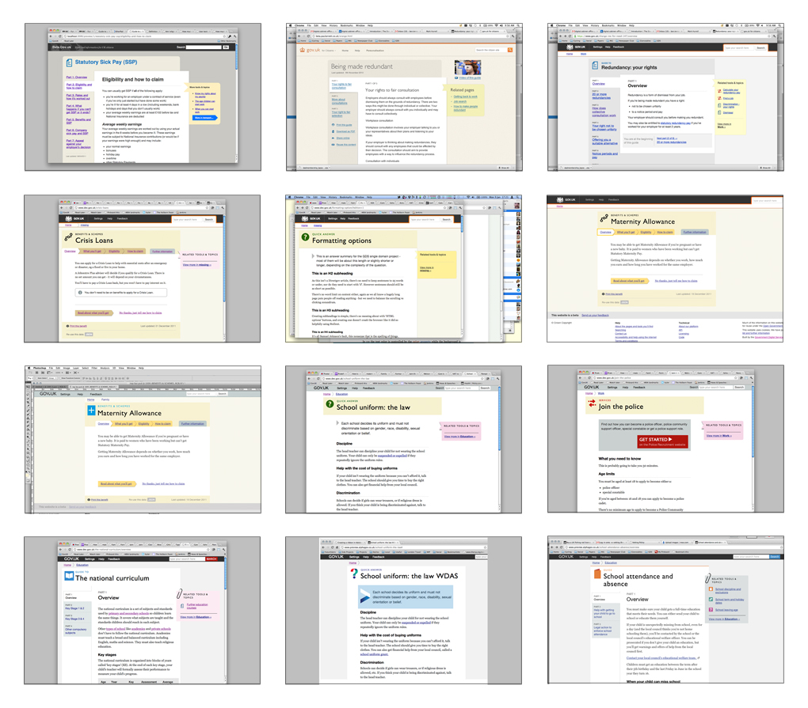
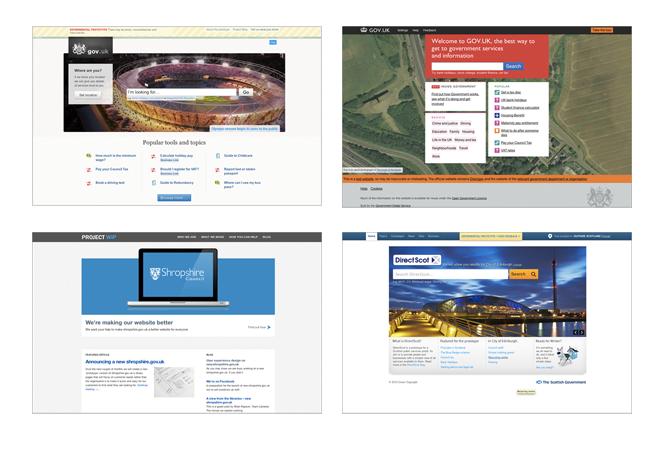
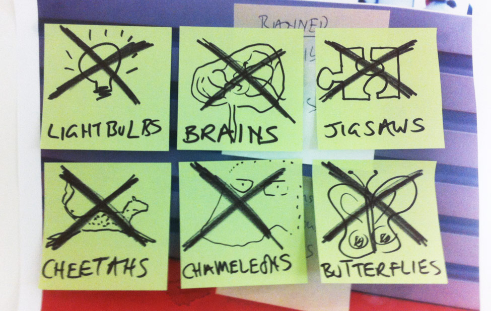

# **Принципи проектування** цифрових послуг британського уряду

Нижче наведені загальни принципи проектування та приклади їх практичного використання. Загальні принципи такі:

1. [Починайте з потреб\*](#1)
2. [Робіть менше](#2)
3. [Проектуйте свідомо](#3)
4. [Робить просто](#4)
5. [Просувайтесь крок за кроком](#5)
6. [Створюйте для людей](#6)
7. [Враховуйте обставини](#7)
8. [Створюйте цифрові послуги, а не сайти](#8)
9. [Будьте послідовними, але не одноманітними](#9)
10. [Робіть все відкрито: так виходить краще](#10)

#1
# Починайте з потреб\*
### \*потреб користувачів, а не уряду.

Процесс проектування має починатися з виявлення та анізу потреб простого користувача. Ми маємо бути зорієнтовані саме на це та не зважати на дурниці, навідь якщо вони мають гриф "офіційно". Наше розуміння потреб має базуватися на фактах, а не на припущеннях чи побажаннях: слід усвідомлювати, що те, про що просить користувач не завжди є тим, чого він насправді хоче.

Саме потреби ми використовуєм як організаційні принципи, тому що користувачі заходять на наші сайти не для того, щоб згаяти час: їм потрібні відповіді. Такий підхід дозволяє сконцентруватися на головному, на тих речах, які неможливо оцінити грошима.

## Приклади того, як ми починали з потреб

Якщо ми почнемо не з головного, у нас не буде можливості створити приваблюючий та фукціональний дизайн. Тому перед початком буть-якого проекту ми приділяєм багото часу на виявлення справжніх потреб користувача.

[Ця стаття описує в основному те, як ми це робим](http://digital.cabinetoffice.gov.uk/2011/09/19/introducing-the-needotron-working-out-the-shape-of-the-product/).

## Все має бути зрозумілим

[Ця сторінка про ПДВ](https://www.gov.uk/vat-rates) є добрим прикладом дизайну, який відповідає потребам користувача. Більшість людей відвідають цю сторінку в пошуках ставки ПДВ. Відповідь, яка їм потрібна - 20%, тому цю цифру видно одразу. Крім цього, існує й інша інформація про ПДВ, яку ми також наводимо, але в якості додаткової інформації. Також існує ймовірність, що користувач потрапив на сторінку помилково, тому в верхньому куті праворуч наведено кілька посилань на пов'язані с ПДВ теми.

Ця сторінка проста та зрозуміла, вона містить різну інформацію, але вся вона може знадобитися.

#2
# Робіть менше

Уряд має робити те, ща може зробити лише він. Якщо хтось може це зробити - наведить посилання на нього. Якщо ви можете запропонувати будь-який ресурс (наприклад, [API](https://ru.wikipedia.org/wiki/%D0%98%D0%BD%D1%82%D0%B5%D1%80%D1%84%D0%B5%D0%B9%D1%81_%D0%BF%D1%80%D0%BE%D0%B3%D1%80%D0%B0%D0%BC%D0%BC%D0%B8%D1%80%D0%BE%D0%B2%D0%B0%D0%BD%D0%B8%D1%8F_%D0%BF%D1%80%D0%B8%D0%BB%D0%BE%D0%B6%D0%B5%D0%BD%D0%B8%D0%B9)), який може допомогти людям - обов'яково зробить це. 

Ми  маємо сконцентруватися на головному. Наша мета - створення ефективних сервісів при мінімальних бюджетах. Тому треба робити те, що принесе найбільшу користь.

## Приклад того, як ми робим менше

Дизайни багатьох сайтів можна вважати невдалими через те, що не зрозуміло чому присвячена та чи інша сторінка. Не намагайтеся розмістити все, що тільки можна. Якщо ви спробуєте зробити менше та з самого початку визначите, що є головним - ви отримаете простий та зрозумілий дизайн.

Ще раз наголосимо, що уряд має робити лише те, що може зробити тільки він. Тому, якщо вам потрібно навести інформацію про ПДВ - зовсім непотрібно писати
[про бджіл](http://webarchive.nationalarchives.gov.uk/20121015000000/www.direct.gov.uk/en/Environmentandgreenerliving/Smallholders/DG_179478).

#3
# Проектуйте свідомо

Частіше за все, ми починаємо не на пустому місці. Люди вже користуються подібними сервісами, а це означає, що ми можемо аналізувати як все праціє насправді. Це дійсно варто робити. Слід про це пам'ятати під час створення та розвитку проектів - на стадії розробки протипів та їх тестуванні звичайними користувачами в реальних умовах. Для нас важливо розуміти суть: що головне, а що другорядне, та вірно розставляти акценти при створенні дизайну.

В цьому полягає голова перевага цифрових послуг - ми можемо спостерігати за поведінкою користувачів та змінювати систему залежно від їх потреб. Ми маємо адаптувати систему під людей, а не навпаки: примущувати людей пристосовуватись до системи.

## Приклада того, як ми проектуємо свідомо

Натоптані стежки – це кращій спосіб зрозуміти, що хоче зробити користувач. 

Блискуче пояснення, що таке натоптані стежки в данному контексті, можете прочитать на [Вікіпедії](https://en.wikipedia.org/wiki/Desire_path), а також побачити кілька прикладів [в цьому пулі на сайті Flickr](http://www.flickr.com/groups/desire_paths/pool/).

## A/B тестування

Ми використовуєм [A/B тестирование](https://ru.wikipedia.org/wiki/A/B-%D1%82%D0%B5%D1%81%D1%82%D0%B8%D1%80%D0%BE%D0%B2%D0%B0%D0%BD%D0%B8%D0%B5), щоб зрозуміти, как колір впливає на поведінку користувача. 

Далі ми докладніше розкажемо на що звертати увагу при аналізі поведінки корустувача. Існує кілько способів провести таке тестування - в якості приклада не можемо не навести [Google Analytics](http://www.google.com/analytics/), який є досить популярним інструментом.

#4
# Робіть просто

Легко зроби так, щоб щось виглядало простим; а ось зробити щось дійсно простим - складно, особливо коли мова йже про складні речі. Але саме це треба робити.

З великою владою приходить і велика відповідальність - досить часто люди не мають вибору і використовують саме наші сервіси. Якщо ми не будимо приклати зусиль для того, щоб зробити їх простими та зручними, це означає, що ми зловживаємо владою на марно гаємо час користувачів.

## Приклад того, як ми зробили просто

Вам не обов'язково розуміти як працює уряд, щоб взаємодіяти з ним. Уряд може надавати досить скоадні послуги, проте всю складність ми маємо приховати настільки, наскільки це можливо.

Наш формат [Smart Answer](http://digital.cabinetoffice.gov.uk/2012/02/16/smart-answers-are-smart/)
є добрим прикладом. Як «[Знижка з прибуткового податку для родинних пар](https://www.gov.uk/calculate-married-couples-allowance)»,
так і «[Допомога при вагітності та пологах](https://www.gov.uk/maternity-benefits)» – це хороші приклади того, як ми взяли щось складне та зробили з нього щось просте та зрозуміле. [Код для Smart Answer ви можете знайти на GitHub](https://github.com/alphagov/smart-answers).

#5
# Просувайтесь крок за кроком

Кращій спосіб створити ефективний сервіс - це почати с чогось малого та потім поступово ускладнювати в швидкому темпі. Тому спочатку створюйте [продукт з мінімальним функціоналом](http://en.wikipedia.org/wiki/Minimum_viable_product), протестуйте його на реальних людях,
просувайтесь від [альфа-](http://en.wikipedia.org/wiki/Software_release_life_cycle#Alpha) та [бета-версій](http://en.wikipedia.org/wiki/Software_release_life_cycle#Beta) до кынцевого результату, додаючи нових функцій та вдосконалень, які основані на поведінці на відгуках користувачів.

Просування крок за кроком мінімізує ризики. Воно зводить нанівець вірогідність великих помилок та перетворює дрібні помилки на уроки. Це дозволяє уникнути необхідності детальних описів на 200 сторінок, які часто стають вузьким місцем. В цьому ж, знов таки, є перевага цифрових технологій: не мости будуємо - все можна виправити.

## Кілька прикладів як ми просувались крок за кроком

Як тільки ви зраділи, що ваш код працює, впевніться в тому, що что він "чистий" та зрозумілий, щоб спростити подальшу роботу з ним собі чи коллегам. Часто це також призводить до спрощення та скорочення коду. Якщо ви робили щось однакове двічі, зробіть перерву, перш ніж зробити втретє. Подумайте, як ви можете все перебудувати, щоб не повторюватися. Наприклад, використовуйте класи CSS замість ID для вибору стандартних елементів.

## Запускайте та вдосконалюйте

Робіть оновлення як можна частіше - не зволікайте. "Запуск" - це не кінець проекту, а можливість протестувати продукт в реальних умовах та отримати відгуки. Аналізуйте їх та безперервно вдосконялюйте свій продукт. Кілька прикладів ви можете знайти в блозі [в циклі 1 дня](http://digital.cabinetoffice.gov.uk/2012/02/01/govuk-beta-day1/), та подальших циклах  [наступного тиждня](http://digital.cabinetoffice.gov.uk/2012/02/02/day-2-of-gov-uk-more-iteration/) на GOV.UK beta,
а також прочитати про оновлення, які відбулися протягом першого тиждня на сайті
[INSIDE GOVERNMENT](http://digital.cabinetoffice.gov.uk/2012/03/13/inside-government-how-busy-the-busy-bees-have-been/).

## Альфа. Бета.

[Альфа-версію сайту GOV.UK](http://alpha.gov.uk/) ми випустили минулого року, а [бета-версія](https://www.gov.uk/) вийшла в січні. Урядовці також почали використовувати таких підхід: 
[Shropshire WIP](http://shropshire.gov.uk/projectwip/) та [DirectScot](http://www.directscot.org/) - гарні тому приклади

#6
# Створюйте для людей

Хороший дизайн сайту - це коли заходиш на сторінку і тобі все зрозуміло. Ми створюємо продукт, який повинен бути простим, привабливим та легко сприймався. Якщи для цього потрібно відмовитися від зовнішнього лоску - нехай так і буде. Не потрібно хвилюватися з цього приводу, не варто прагнути до нових горизонтів веб-дизайну, але слід чітко усвідоблювати що ти хочешь зробити.

Ми створюємо продукт для всієї країни, а не для тих, хто звик користуватися інтернетом. Більш того, наші сервіси потрібні перш за все тим людям, яким важко орієнтуватися в світі інформації. Якщо з самого початку ми будем орієнтуватися на них - ми зробимо продукт для всіх без винятку.

## Кілька прикладів того, що ми створювали для людей

Ця таблиця - гарний приклад використання кольрів з високим контрастом, що спрощує візуальне сприймаття.

## Значення розмітки ARIA

<pre><code>
&lt;div role="banner"&gt;
…
&lt;/div&gt;

&lt;div role="navigation"&gt;
&lt;ul&gt;
…
&lt;/ul&gt;
&lt;/div&gt;

&lt;div role="contentinfo"&gt;
…
&lt;/div&gt;
</code></pre>

Розмітка ARIA допомогає людям, які використовують екранні диктори чи інші допоміжні технології, для яких важлива чітка структура сторінки. В цьому відео показано, я використовують екранний диктор за рахунок розмітки ARIA:

[Як розмітка ARIA допомагає людям, які користуються екранними дивторами](http://www.nomensa.com/blog/2011/how-aria-landmark-roles-help-screen-reader-users/)

## Поля та мітки форми

<pre><code>

&lt;label for="name"&gt;Name:
&lt;input type="text" id="name" placeholder="For example John Smith" /&gt;
&lt;/label&gt;

&lt;label for="yes"&gt;
&lt;input type="radio" name="citizen" id="yes" value="yes" /&gt;
Yes&lt;/label&gt;
&lt;label for="no"&gt;

&lt;input type="radio" name="citizen" id="no" value="no"&gt;
No&lt;/label&gt;

</code></pre>
                

Мітки форми допомогають ввести правільну інформацію. Якщо пов'язати між собою мітки та поля форми за допомогою HTML, можна досягти того, що люди, які використовують екранні диктори, також зможуть ввести потрібну інформацію.

Також має значення де знаходиться мітка. Для прапорців та перемикачів її краще розташувати праворуч. Для інших типів полів - ліворуч. 

<pre><code>&lt;!-- In HTML --&gt;
&lt;a href="#content" class="visuallyHidden"&gt;Skip to content &lt;/a&gt;

/* In CSS */
.visuallyHidden {
  position: absolute;
  left: -999em;
}</code></pre>

Посилання для швидкого переходу переносять користувача в іншу частину сторінки. Це дозволяє скоротити шлях людям, які не використовують мишу.

Краще місце для розташування посилання для швидкого переходу - верхня частина сторінки. Так до нього простіше добратися використовуючи лише клавіатуру.

Посилання для швидкого переходу можуть бути приховані, тобто відображатися лише тоді, коли на них наводиться фокус клавіатури. Такий підхід робить посилання доступними навідь для незрячих користувачів.

## Зрозумілий текст посилань

<pre><code>&lt;a href="guide.html"&gt;Guide to maternity leave&lt;/a&gt;</code></pre>

Посиляння - це перш за все вказівка на інформацію. З тесту посилання моє бути зрозуміло куди воно приведе.

Також краще не вказувати спосіб, яким посилання може бути активоване. Наприклад, люди які використовують пристрої з сенсорним екраном чи працюють лише з клавіатурою не можуть "клікнути мишею сюди"

#7
# Враховуйте обставини

Ми створюємо дизайн не для монітора, ми створюємо його для людей. Тому бажано передбачити, де саме коритувачі можуть використовувати наш продукт. Вони заходять на сторінку з бібліотеки? Чи з мобільного пристрою? Вони знають що таке Facebook? Вони раніше користувалися інтернетом?

Ми створюємо дизайн для дуже великої групи людей, які мають різні потреби та використовують різні технології. Нам необхідно бути впевненими, що незалежно від обставин, наш продукт буде працювати добре. Інакше ви ризикуєм створити нікому непотрібний сервіс.

## Приклади того, як ми врахували обставини

Доступ до вашого сервісу можне знадобитися користувачеві з будь-якої частини cвіту, здійсніватися за допомогою різних пристроїв в різних обставинах. Намагайтеся врахувати все це. Як буде вести себе ваш сайт, якщо на нього зайти з малопотужного комп'ютера міської бібліотеки? А зі смартфона на ходу?

Пам'ятайте, ми забезпечуємо доступ до інформації, а не просто ганяємо пікселі екраном.

#8
# Створюйте цифрові послуги, а не сайти

Наші сервіси не починаються з сайтів та не закінчуються ними. Вони починаються зі створення алгоритмів пошуку та закінчуються почтовим відділенням. Ми маємо це враховувати в дизайні, навідь якщо це складно. Також нам слід розуміти, що колись, несподівано для нас, може з'явитися нова цифрова послуга.

Тож слід орієнтуватися саме на створення цифрових послуг, а не на створення сайтів. Зараз нема кращого інструмену ніж інтернет, проте все може змінитися скоріше, ніж ми це собі уявляємо. 

## Один приклад використання контенту за межами нашого сайту

Один з таких прикладів – це [плагін WordPress](http://saulcozens.co.uk/pages/wordpressgovuk),
створений Саулом Козенсом для «відтворення контенту з сайта GOV.UK через через будь-який пост чи сторінку WordPress».

#9
# Будьте послідовними, але не одноманітними

Бажано використовувати одну мову та одні шаблони скрізь, де це можливо - так люди звикають до наших сервісів. Там, де це неможливо, потрібно зберегти хоча б загальних підхід - тоді користувачам легше буде зорієнтуютися.

Проте намагайтеся не бути одноманітними. Неможливо робити хороші сервіси "під копірку". Неможливо все передбачити та спрогнозувати. Будь-яка обставина має розглядатися в контексті. Якщо ваші продукти будуть схожими за загальним підходом - значить ви послідовні, а ваши користуваючи розібравшись один раз будуть завжди легко орієнтуватися.

## Приклад нашої работи, яка показує послідовність, але не одноманітність

Поки що ми запустили бета-версії наших сайтів GOV.UK та INSIDE GOVERNMENT. Порівняння дизайнів двох сторінок продемонструє що ми мали на увазі. Здається, що обидва сайти - близьки родичі. Проте вони не дублюють один одного, адже виконують різні функції.

#10
# Робіть все відкрито: так виходить краще

Якомога частіше діліться тим, що ви робите. З колегами, з користувачі, зі світом. Діліться кодом, дизайном, ідеями, намірами, навідь помилками. Чим більше очей дивиться на сервіс - тим краще він стає: помилки випрявляються, напрацьовуються новіі варіанти, зростає якість.

Більша частина з того, що ми робим, можлива завдяки відкритим джерелам та співрозумінню веб-дизайнерів. Тому бажано відповідати тим же, адже відкритість робить сервіси краще. Якщо зробити код відкритим - зрештою його буде вдостконалено. Саме тому ми намагаємся ділитися якомога частіше.

## Дизайн

Це приклад з [GOV.UK beta](https://www.gov.uk/), який демонструє більшість цих принципів в дії.

## Палітра кольорів

Це кольори, які були використувані для [GOV.UK](https://www.gov.uk/). Палітра досить широка, тому що у сайта великі потреби. За основу були взяті світлі кольори, а більш яскраві використовуються якщо треба привернути увагу.

Ви можете [скачати цю палітру кольорів у вигляді файлу Adobe Swatch Exchange](downloads/betacolours.ase), а потім імпортувати їх в програми Photoshop або Illustrator.

Також ви можете скачати [pdf-файл палітри кольорів](downloads/betacolours.ase), щоб копіювати та вставляти їх в шестизначні коди.

## Шрифти

Шрифти – це досить важлива частина дизайну, від якої залежить легкість сприймання інформації користувачем. Сьогодні ми маємо змогу як ніколи широко їх використовувати, тому ми маємо впевнитися в тому, що наді дії йдуть на користь справі. 

Протягом наступних місяців ми будемо тестувати різні види дизайну шрифтів.

Зараз для заголовків та назв розділів ми використовуєм [Gill Sans](http://en.wikipedia.org/wiki/Gill_Sans). Ми використовуєм техногію "веб-шрифт", яку неможна назвати ідеальною, а тому слід використовувати обережно. Проте якщо все робити правильно - шрифт виглядає досить сучасно і по-британськи водночас.

Для основного тексту ми використовуєм шрифт Georgia. Це саме те, що люди будуть читати, навідміну від назв, які зазвичай лише проглядають. Він був створений [британським оформувачем шрифтів](http://en.wikipedia.org/wiki/Georgia_().

Для всього іншого ми використовуєм шрифт Helvetica, якщо він встановлений у користовача, або Arial.

Повний перелік стилів шрифтів, які ми використовували, демонструється вище.

## Іконки

Ось іконки, які ми використовували на сайті GOV.UK.

## Спільно створений код

Інструменти накшталт [Github](http://www.github.com) досить зручні, адже люди можуть робити «[запити на внесення змін ](http://help.github.com/send-pull-requests/)» що дає змогу покращити ваш код. Більше про це можна дізнатися в нашій статті – «[GOV.UK – повністю відкрита та колективно створена платформа ](http://digital.cabinetoffice.gov.uk/2012/02/02/gov-uk-truly-open-platform/)»
(GOV.UK – a truly open and collaborative platform).

## Принципи контенту

Контент – всьому голова. Наші рішення, [стиль та способи подачі контенту описані тут](/design-principles/style-guide).

## Операції

Що таке «операція»?

Наприкінці операції має відбутися якась дія (мається на увазі щось більше, ніж просто обмін інформацією). Зазвичай це обмін товарами чи грошима, у випадку уряду - це передача законних прав чи обов'язків або їх створення. Ще одна відмінна риса більшості урядових операцій - це те, що часто в них бере учать більше двох сторін.

## Більше подробиць і якомога швидше

Зараз ми працюємо над цілою низкою операцій для створення послідовних шаблонів, які ми зможено використовувати в подальшому в різних сценаріях.

## Де-які ідеї, від яких мим відмовилися

Наші спроби передати інформацію користувачам мають бути простими та зрозумілими. Досить часто візуальні метофори, які ми застосовуємо, не допомогають, а лише плутають. Через це від "лампочки", "мозгів", "головоломки", "гепарду", "хамелеона", "метелика"... ми відмовились.

# Про переклад

Українською переклав chereshnik для [MaidanHackthon](https://www.facebook.com/groups/MaidanHackthon/) Оригінал [тут](http://www.uxfox.ru/btitish-goverment-design-principles/).

